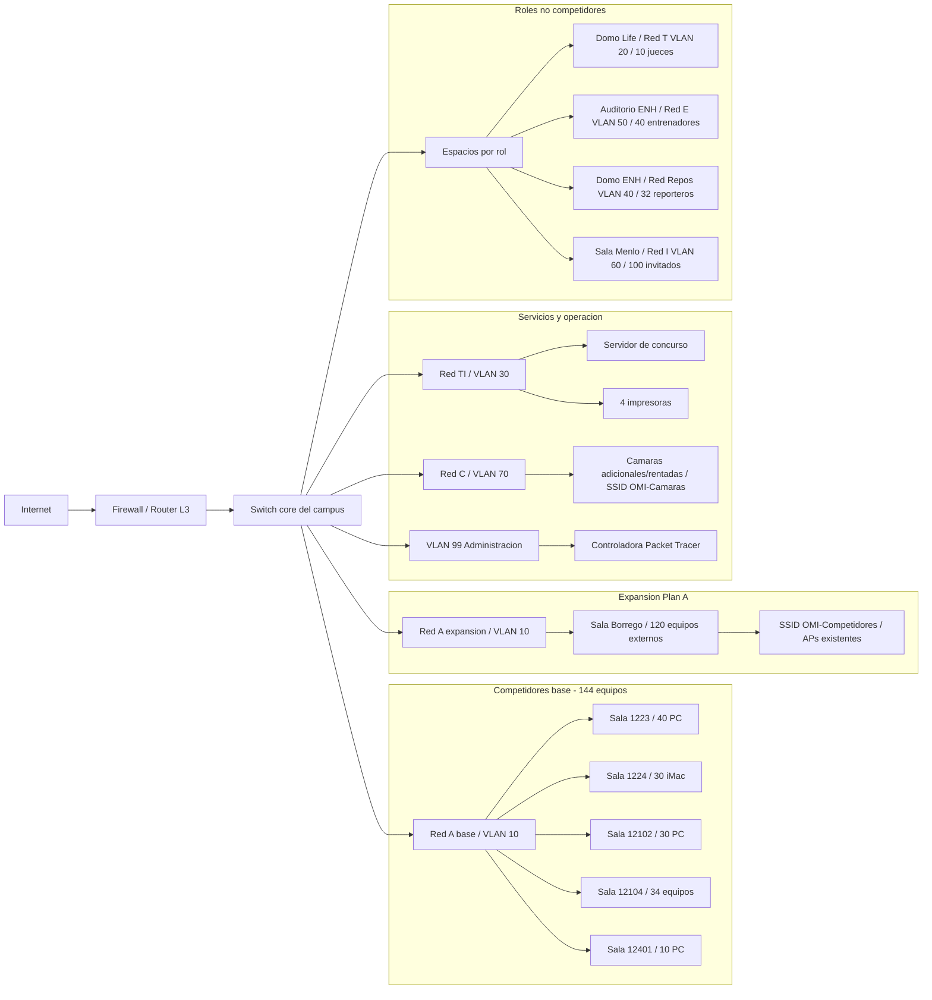
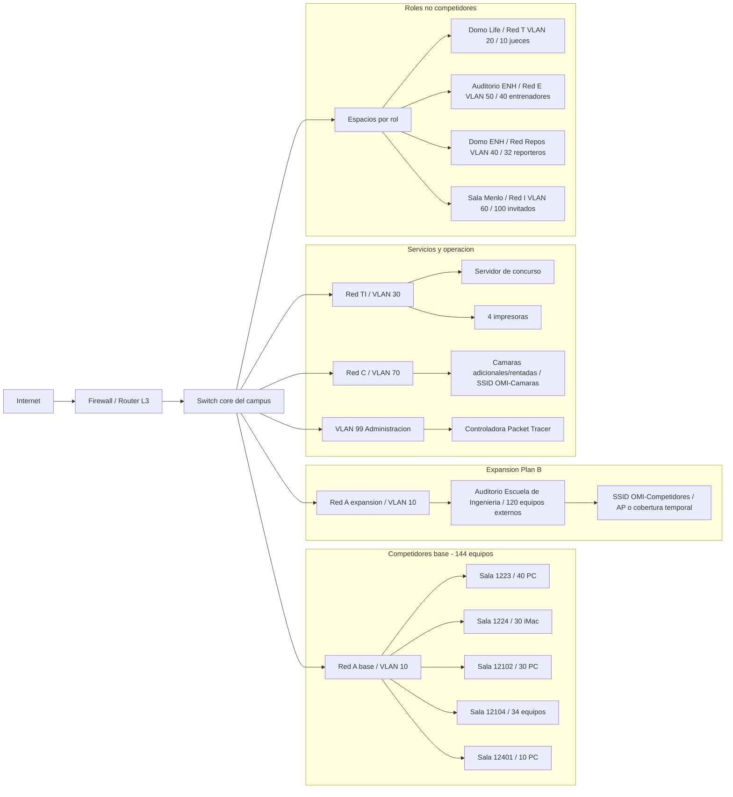

# ActReto01 - Bosquejos de red

Este documento complementa el entregable `ActReto01.md` con los bosquejos de red de las dos alternativas documentadas para el evento. El Plan A queda como alternativa seleccionada y el Plan B queda como contingencia si Sala Borrego no cumple las condiciones físicas requeridas.

## Bosquejo Plan A - Sala Borrego

## Bosquejo Plan B - Auditorio Escuela de Ingeniería

## Leyenda de VLANs

| VLAN | Red | Uso |
| ---: | --- | --- |
| 10 | Red A | Competidores base y equipos externos |
| 20 | Red T | Jueces |
| 30 | Red TI | Servidor e impresoras |
| 40 | Red Repos | Reporteros |
| 50 | Red E | Entrenadores |
| 60 | Red I | Invitados |
| 70 | Red C | Cámaras inalámbricas rentadas |
| 99 | Administración | Controladora Packet Tracer |
